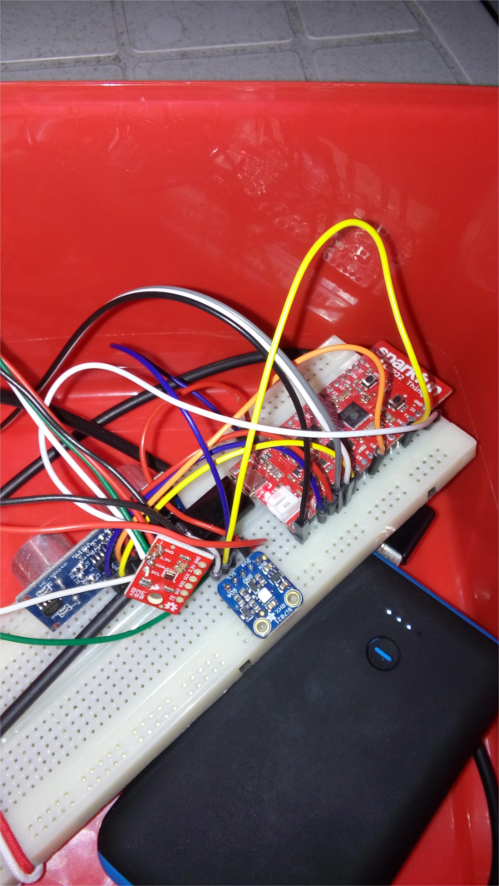

# esp32_weather
Collect data from bosh/sparkfun BME280 & Si7021 over i2c and the internal esp32 temperature sensor. Send data to thingspeak.com and go back to sleep.

Here are the reuslts.
https://thingspeak.com/channels/209116
https://thingspeak.com/channels/212260
For the first dataseries I opened the window, closed the window, used a hair-drier and then just let is sit with the window closed.
For the second one I put the esp32 in a box that I places outside.

After this test i solved the problem with bootcount being lost.
```
    esp_deep_sleep_pd_config(ESP_PD_DOMAIN_RTC_SLOW_MEM, ESP_PD_OPTION_ON);
```
That statement was missing in the 06_sntp example. Now I will let the board run on a 7800mAh battery and continue to update this thingspeak channel https://thingspeak.com/channels/212260
I also added pressure to this feed. As measurements indoors wasnt so exciting I moved the data collection outside.

For temperature measurements, I used the adafruit si7021 temperature humidity board & Sparkfun BME280 board.

https://cdn-learn.adafruit.com/assets/assets/000/035/931/original/Support_Documents_TechnicalDocs_Si7021-A20.pdf
Both are i2c boards, here is the output when running.
The esp32 will wakeup every 6 seconds and check the boot_count. This is done as otherwise the battery will switch off. Every minute wifi will be started and the collected data will be logged on http://thingspeak.com


#i2c_init
Before the modules can be used, this must be called.
```
/**
 * @brief i2c master initialization
 */
void i2c_init()
{
    int i2c_master_port = I2C_MASTER_NUM;
    i2c_config_t conf;
    conf.mode = I2C_MODE_MASTER;
    conf.sda_io_num = I2C_MASTER_SDA_IO;
    conf.sda_pullup_en = GPIO_PULLUP_ENABLE;
    conf.scl_io_num = I2C_MASTER_SCL_IO;
    conf.scl_pullup_en = GPIO_PULLUP_ENABLE;
    conf.master.clk_speed = I2C_MASTER_FREQ_HZ;
    i2c_param_config(i2c_master_port, &conf);
    i2c_driver_install(i2c_master_port, conf.mode, I2C_MASTER_RX_BUF_DISABLE, I2C_MASTER_TX_BUF_DISABLE, 0);
}
```

#i2c_scan
Simple but useful to see the assigned adresses of the i2c devices.
```
/**
 * _____________________________
 * | start | slave_addr  + sack | 
 * --------|--------------------|
 *
 */
esp_err_t i2c_master_check_slave(i2c_port_t i2c_num,uint8_t addr)
{
    i2c_cmd_handle_t cmd = i2c_cmd_link_create();
    i2c_master_start(cmd);
    i2c_master_write_byte(cmd, ( addr << 1 ) , ACK_CHECK_EN);
    i2c_master_stop(cmd);
    esp_err_t ret = i2c_master_cmd_begin(i2c_num, cmd, 1000 / portTICK_RATE_MS);
    i2c_cmd_link_delete(cmd);
    return ret;
}

void i2c_scan() {
    int address;
    int ret;
    int foundCount = 0;
    for (address=1; address<127; address++) {
        ret=i2c_master_check_slave(I2C_MASTER_NUM,address);
        if (ret == ESP_OK) {
            printf("Found device addres: %02x\n", address);
           foundCount++;
        }
    }
    printf("Done scanning.. found %d devices\n",foundCount);
}
```
#The si7021 board
https://cdn-learn.adafruit.com/downloads/pdf/adafruit-si7021-temperature-plus-humidity-sensor.pdf
Future enhancements could be to add heating function to enhance humidity sensing. 

```
    i7021.humidity=i2c_7021_read_rh();
    i7021.temp=i2c_7021_read_temp();
```


#The BME280 weather data board
https://github.com/sparkfun/SparkFun_BME280_Arduino_Library
https://github.com/BoschSensortec/BME280_driver
To save battery, we use this sensor in forced mode.
i2c_bme280_begin(); puts the sensor in normal run mode. After calling i2c_bme280_force_readings(); the sensor does one measurement and then goes back to sleep mode. (0)
```
    i2c_bme280_begin();
    i2c_bme280_force_readings();
    bme280.temp=i2c_bme280_read_temp();
    pressure=i2c_bme280_read_pressure();
    bme280.humidity=i2c_bme280_read_rh();
    printf("RH %d Temp %d , pressure %f\n",bme280.humidity,bme280.temp,pressure/100.0);
    printf("power mode %x\n",i2c_bme280_get_power_mode());
```

